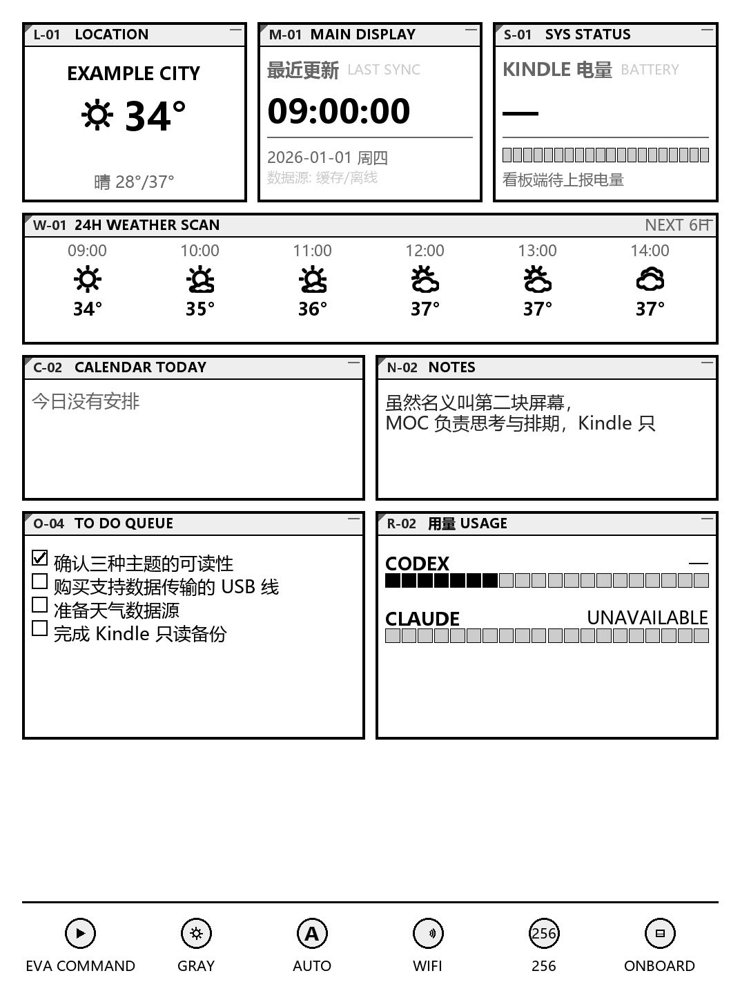

# Kindle Dashboard

把 Kindle 变成一块安静的墨水屏信息看板：PC 端渲染 1072×1448 16 级灰 PNG，Kindle 端通过 Wi-Fi `curl` 拉图并用 `eips` 上屏。不停原生 `framework`，靠 15 秒保守重绘压住主页，同时保留 KUAL、触屏和正常阅读功能。



## 特性

- **8 面板布局**：位置天气、最近更新、Kindle 电量、24H 天气扫描、今日日程、笔记、待办队列、AI 用量（Codex / MiniMax）。
- **自动发现 PC IP**：Kindle 端启动时扫本机网段，按 token 校验找到正确 PC，换 Wi-Fi 无需手动改 IP。
- **电量上报**：Kindle 把电池/充电状态回传到 PC，`SYS STATUS` 面板显示真实剩余电量。
- **用量面板**：Codex 用本地 SQLite 日志 + `codex app-server` 读取 5 小时窗口剩余额度；MiniMax 用 `mmx quota show`。
- **不停止 framework**：采用 [kindle-side-card](https://github.com/perduewu-ops/kindle-side-card) 思路，15 秒重绘一次缓存帧，KUAL 和触屏都可用。
- **断网自愈**：连续取图失败 3 次后自动重扫 PC IP。

## 目录结构

```
kindle-dashboard/
├── src/                 # PC 端：渲染器、看板生成器、HTTP 服务、采集器
│   ├── dashboard_renderer.py   # 1072×1448 16 级灰 PNG 渲染
│   ├── build_dashboard.py      # 聚合数据并触发渲染
│   ├── dash_server.py          # HTTP 服务：/dash.png /report /health
│   └── collectors/             # 天气、用量、日记笔记等数据源
├── tools/               # PC 辅助脚本
│   ├── kindle_ext_builder.py   # 生成 KUAL 扩展并部署到 Kindle
│   └── start_dash_server.bat   # Windows 开机自启脚本
├── kindle_ext/          # Kindle 端主循环
│   ├── dash.sh                 # 拉图 + 上屏 + 电量上报（15 秒重绘）
│   ├── server.conf.example     # 部署到 Kindle 的 server.conf 模板
│   └── 换wifi维护指南.md       # 只给 agent 看的维护备忘
├── config/              # 配置文件（示例已入库，真实文件被 .gitignore）
│   ├── weather.example.json    # 和风天气配置示例
│   ├── minimax.json            # MiniMax CLI 调用配置（无 API key）
│   └── config.example.yaml     # 环境变量占位配置
├── samples/             # 脱敏示例渲染图
├── LocationList/        # 公开 POI 数据（非敏感）
└── QWeather-Icons-1.8.0/  # 第三方图标库，保留原 LICENSE
```

## ⚠️ 安全须知（必读）

1. **Token**：`dash_server.py` 会自动在 `~/.dash_server/token` 生成 43 字符随机串。不要复制仓库里的任何 token 示例，每个部署应独立生成。
2. **和风天气 key**：`weather.py` 优先读取环境变量 `QWEATHER_API_HOST` / `QWEATHER_API_KEY`，缺失时回退 `config/weather.json`（该文件已被 `.gitignore` 忽略，不会入库）。
   ```powershell
   $env:QWEATHER_API_HOST="你的和风 API Host"
   $env:QWEATHER_API_KEY="你的和风 Private Key"
   ```
3. **MiniMax / Codex**：分别依赖本机已登录的 `mmx` CLI 和 `codex` CLI，代码里不存 API key。
4. **Kindle 端 `server.conf`**：部署时由 `kindle_ext_builder.py` 从 PC 的 `~/.dash_server/token` 自动填入，不要手写仓库里的示例 token。

## 依赖

- Windows / macOS / Linux（PC 端，Kindle 端是 Linux Shell）
- Python 3.10+
- Pillow（渲染 PNG）
- 和风天气账号（免费订阅即可，用于天气面板）
- Kindle 已越狱 + KUAL（Kindle Unified Application Launcher）
- PC 与 Kindle 在同一 Wi-Fi 下

Python 依赖：

```bash
pip install -r requirements.txt
```

## 快速开始

### 1. PC 端启动服务

```powershell
# PowerShell 推荐：先配天气 env
$env:QWEATHER_API_HOST="hwxxxxx.re.qweatherapi.com"
$env:QWEATHER_API_KEY="你的 Private Key"

# 启动服务（--auto-build 表示每次拉图都会自动重建最新看板）
python src/dash_server.py --image samples/preview_home.png --port 8765 --auto-build
```

首次启动会生成 `~/.dash_server/token`，并在控制台打印 URL：

```
http://<本机IP>:8765/dash.png?t=<自动生成 token>
```

### 2. Windows 开机自启

把 `tools/start_dash_server.bat` 放进启动文件夹：

1. `Win + R` → 输入 `shell:startup` → 回车
2. 复制 `tools/start_dash_server.bat` 进去

> 注意：这个 bat 使用本仓库路径；如果你把项目放到其他位置，需要修改 bat 中的路径。

### 3. Kindle 端部署

#### 方式 A：用 kindle_ext_builder.py 一键部署

USB 连 Kindle，确认出现为 `E:` / `F:` 等可移动磁盘：

```bash
python tools/kindle_ext_builder.py --drive F:
```

脚本会：
- 把 `kindle_ext/dash.sh` 写入 `/mnt/us/extensions/kdashboard/dash.sh`
- 生成 `/mnt/us/dashboard/server.conf`（自动填入 TOKEN，HOST 可自动发现也可手填）

#### 方式 B：手动复制

1. 把 `kindle_ext/dash.sh` 复制到 Kindle 的 `/mnt/us/extensions/kdashboard/dash.sh`
2. 把 `kindle_ext/server.conf.example` 复制到 `/mnt/us/dashboard/server.conf`
3. 修改 `server.conf` 中的 `HOST` 为 PC 当前内网 IP，`TOKEN` 为 `~/.dash_server/token` 的内容

### 4. Kindle 上启动

KUAL → **8. 启动看板主循环**。约 10~20 秒后屏上出现看板。

启动后 Kindle 端会向 PC 的 `/report` 端点上报电量，`SYS STATUS` 面板会显示真实剩余电量。

### 5. 退出看板

USB 连 PC，在 Kindle 盘的 `dashboard/` 目录新建一个空文件 `stop`（无扩展名），再安全弹出拔线。看板下次刷新（≤60 秒）检测到 `stop` 后退出并恢复原生界面；或长按电源键 7 秒硬重启。

## 自动发现 PC IP

`dash.sh` 解析 PC 地址的优先级：

1. 缓存 `dashboard/pc_ip`（上次成功连接的 IP）
2. `server.conf` 的 `HOST`
3. 扫描本机网段（CIDR /24），对每个开放 8765 的主机用 `/report?t=TOKEN` 做 token 校验

因此：
- 日常拉图走缓存/HOST，**不扫网段**。
- 只有启动时或连续取图失败 3 次才会扫描。
- 换 Wi-Fi 后，重启 Kindle 看板即可自动找到新 IP，无需再手动改 `server.conf`。

## 配置天气

和风天气配置推荐用环境变量（不将 key 写入任何会被 git 跟踪的文件）：

```powershell
# PowerShell
$env:QWEATHER_API_HOST="你的 API Host"
$env:QWEATHER_API_KEY="你的 Private Key"

# 临时生效，仅当前终端
# 永久生效：系统设置 → 环境变量 → 新建用户变量
```

如果想用文件，复制 `config/weather.example.json` → `config/weather.json`（`weather.json` 已被 `.gitignore` 忽略），填入真实 key。注意：`weather.json` 不要提交到 git。

## 耗电说明

本方案**不停 framework 也不休眠**，Kindle 会保持唤醒并每 15 秒重绘一次缓存帧。带来的副作用：

- KUAL、触屏、阅读器都可用，原生 UI 不会压在看板上。
- 耗电显著高于“停 framework + RTC 唤醒”方案。Paperwhite 3/4 大概需要每 0.5~1 天充一次电。

如果你不需要保留触屏，可以参考早期版本改用“停 framework + 长间隔唤醒”的省电方案（本仓库 README 历史版本中有）。

## 常见问题

**Q：屏上只显示一部分 / 书架和看板叠在一起？**  
A：确认 `dash.sh` 是最新版（停 framework 的误用已被修正为 15 秒重绘）。KUAL 重新启动看板。

**Q：换 Wi-Fi 后 Kindle 拉不到图？**  
A：PC 端服务必须重启或保持运行；Kindle 端看板重启会自动扫到新 IP。如果仍失败，检查 PC 防火墙是否放行 8765 端口。

**Q：电量面板显示“待上报电量”？**  
A：Kindle 刚启动时尚未上报，等一个 `DAY_INTERVAL`（默认 60 秒）后就会刷新。或确认 `server.conf` 的 `TOKEN` 与 PC 端一致。

**Q：和风天气 key 报错？**  
A：设置环境变量 `QWEATHER_API_HOST` / `QWEATHER_API_KEY`，或确保 `config/weather.json` 存在且 key 有效。

## License

MIT License —— 见 [LICENSE](LICENSE) 文件。

本仓库内置的 `QWeather-Icons-1.8.0` 为第三方图标库，保留其原有 LICENSE 与版权声明。

## 致谢

- 上屏方案参考 [kindle-side-card](https://github.com/perduewu-ops/kindle-side-card) 的保守重绘循环。
- 和风天气提供公开天气 API。
